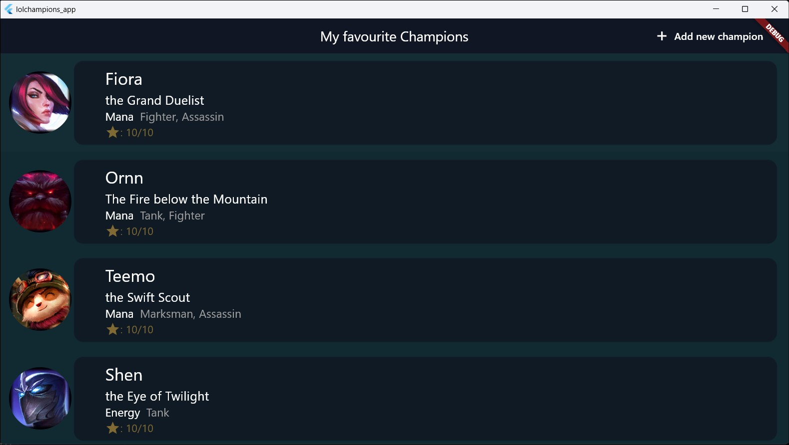
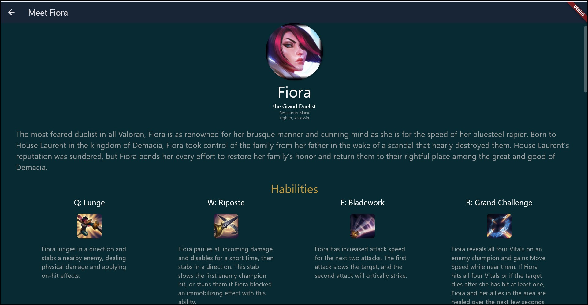

# League of Legends Flutter App

This Flutter app serves as a demonstration of API integration in Flutter, specifically integrating the League of Legends API to display diverse information about different champions.

## Features

- Displays information about various League of Legends champions.
- Utilizes the League of Legends API to fetch data dynamically.
- Provides details such as champion stats, abilities, lore, etc.

## Screenshots




## Prerequisites

Before running the app, make sure you have the following:

- Flutter SDK installed on your machine

## Installation

1. Clone the repository:

```
git clone https://github.com/bescoss/LeagueOfLegends_Api_Flutter_app.git
```

2. Install dependencies:

```
flutter pub get
```

3. Run the app:

```
flutter run
```

## Usage

- Upon launching the app, you will see a list of League of Legends champions.
- Tap on a champion to view detailed information about them.

## Contributing

Contributions are welcome! If you'd like to contribute to this project, feel free to submit a pull request.

## License

This project is licensed under the [MIT License](LICENSE).
